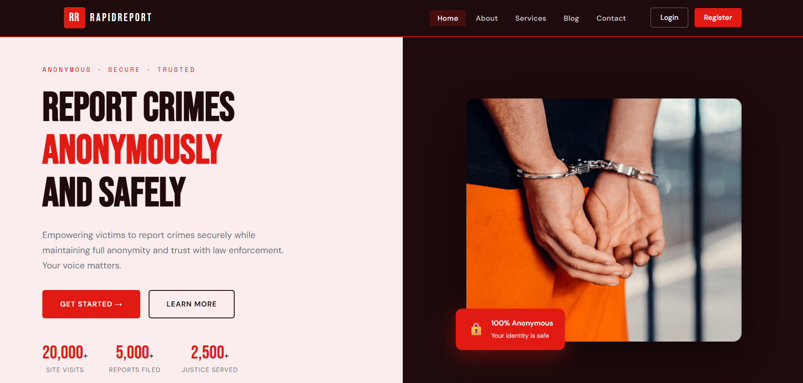

<div align="center">

# RapidReport

### **Report. Protect. Empower.**

*A full-stack, anonymous crime-reporting platform built with Flask & MySQL.*

<br>


<br>

### [Live Link - https://qwer.render.com](https://qwer.render.com)
### [](https://qwer.render.com)

<a href="https://qwer.render.com">
  
</a>

<sub>👆 Click the image to launch the live preview</sub>

</div>

---

## 💡 What is RapidReport?

RapidReport lets people **report crimes anonymously** — without ever exposing their identity — and gives administrators a clean panel to track and resolve those reports.

| For Victims | For Admins |
|-------------|------------|
| 🕶️ Report crimes 100% anonymously | 📊 Dashboard with live stats |
| 🔐 Secure account with hashed passwords | 📋 View & manage every report |
| 📁 Track your own reports in a dashboard | 🔄 Update report status in one click |
| ✉️ Reach out via the contact form | 👥 See registered-user counts |

---

## Features at a Glance

| | Feature |
|---|---------|
| ✅ | **Anonymous Reporting** — submit crime reports without revealing identity |
| ✅ | **Secure Auth** — bcrypt password hashing + Flask sessions |
| ✅ | **User Dashboard** — track the status of every report you file |
| ✅ | **Admin Panel** — view all reports, update statuses, monitor stats |
| ✅ | **Contact Form** — messages saved straight to the database |
| ✅ | **Animated UI** — scroll reveals, counters, responsive design |
| ✅ | **Hardened Config** — secrets via `.env`, debug off by default |

---

## Quick Start

> **Prerequisites:** Python 3.9+ · MySQL 8.0+

```bash
# 1️⃣  Enter the project & set up a virtual environment
cd rapidreport
python -m venv venv
venv\Scripts\activate          # Windows
# source venv/bin/activate     # macOS / Linux

# 2️⃣  Install dependencies
pip install -r requirements.txt

# 3️⃣  Create the database
mysql -u root -p < schema.sql

# 4️⃣  Configure your secrets
cp .env.example .env           # then edit .env → set DB_PASSWORD & SECRET_KEY

# 5️⃣  Launch 🚀
python app.py
```

Then open **http://localhost:5000** — you're live. 

---

## Default Admin Login

<div align="center">

| Field | Value |
|-------|-------|
| 📧 **Email** | `admin@rapidreport.in` |
| 🔑 **Password** | `Admin@1234` |

</div>

> ⚠️ **Change this password immediately after your first login.**
> To promote any user to admin: `UPDATE users SET role='admin' WHERE email='your@email.com';`

---

## Database Schema

| Table | Purpose |
|-------|---------|
| `users` | Registered users with **bcrypt-hashed** passwords |
| `reports` | All crime reports, with status tracking |
| `contact_messages` | Submissions from the contact form |

---

## 🛡️ Security Notes

This build ships with sane security defaults:

- **No hardcoded secrets** — DB password & secret key load from `.env`
- **Debug off by default** — enable only via `FLASK_DEBUG=1` for local dev
- **Passwords hashed** with bcrypt (never stored in plaintext)
- **SQL-injection safe** — all queries are parameterized
- **XSS safe** — Jinja auto-escaping left intact

> Recommended next steps for production: add CSRF protection, login rate-limiting, and set `SESSION_COOKIE_SECURE` behind HTTPS.

---

## 📁 Project Structure

```
rapidreport/
├── app.py              ← Main Flask application
├── schema.sql          ← MySQL database schema
├── requirements.txt    ← Python dependencies
├── .env.example        ← Environment variables template
├── assets/
│   └── indexpage.png   ← Homepage preview
├── templates/          ← HTML pages (Jinja2)
└── static/
    ├── css/style.css   ← All styles
    └── js/main.js      ← Animations & counters
```

---

## 🛠️ Tech Stack

<div align="center">

**Backend** · Python Flask &nbsp;|&nbsp; **Database** · MySQL &nbsp;|&nbsp; **Auth** · bcrypt + Flask sessions
**Frontend** · HTML5 · CSS3 · Vanilla JS &nbsp;|&nbsp; **Fonts** · Bebas Neue · DM Sans · Space Mono

</div>

---

<div align="center">


**© 2026 RapidReport** — *Report. Protect. Empower.*

</div>
